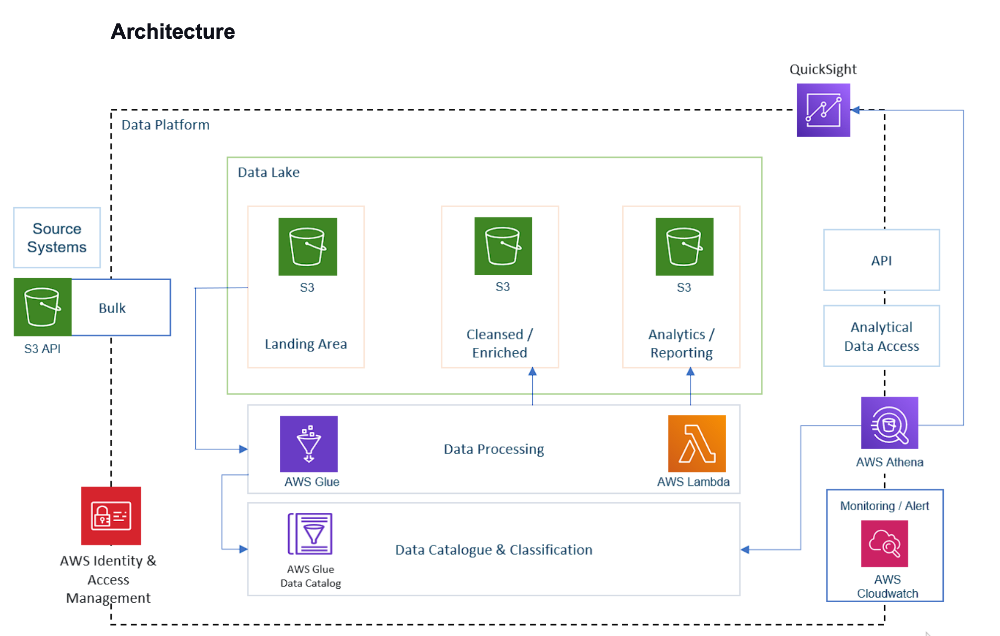

# ETL and analysis on YouTube data
Youtube [data](https://www.kaggle.com/datasets/datasnaek/youtube-new) analysis and ETL pipeline using Python and various AWS tools and services such as Athena, Lambda, and Glue

# Tech
AWS S3, Glue, Athena, Lambda, Quicksight

# Architecture

